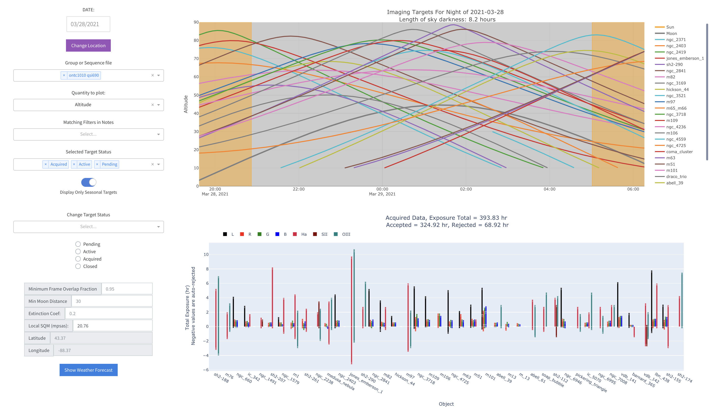
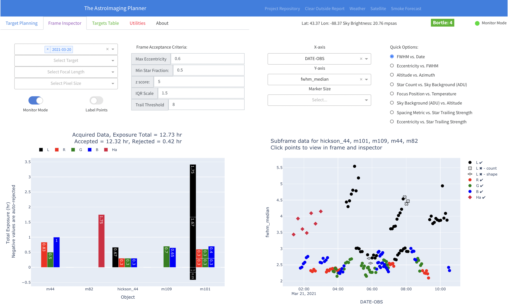
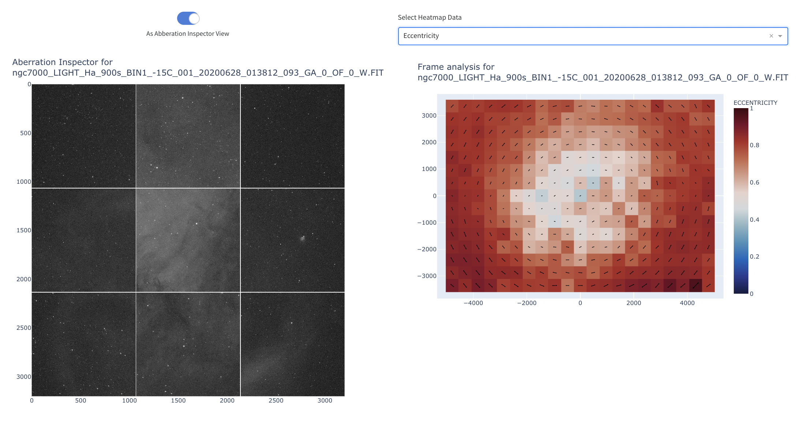
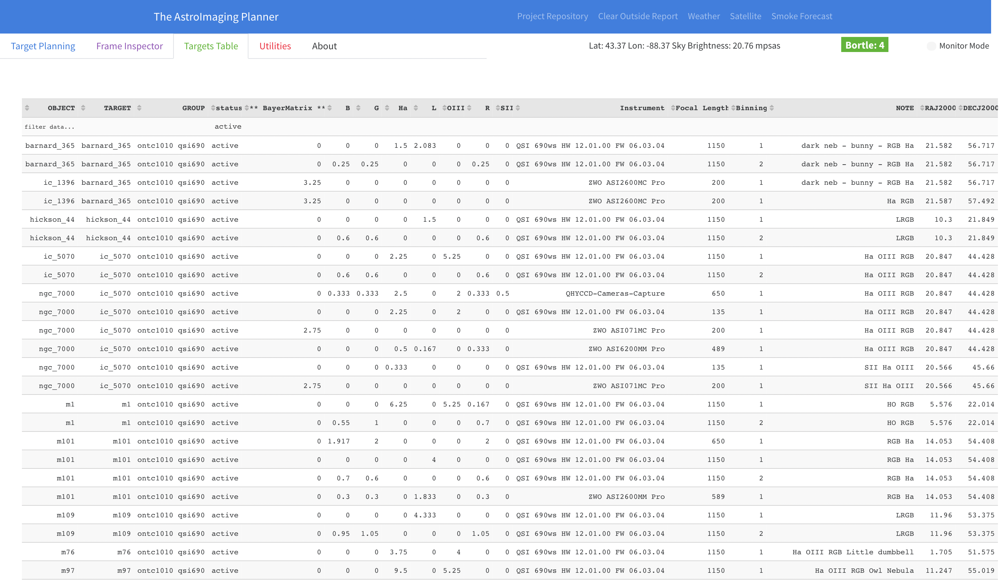
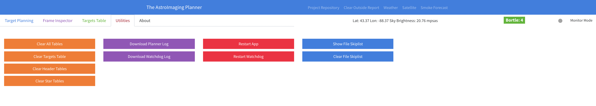

# About This Project
The goal of this dashboard project is to offer the ability to view at a glance the planning and progress of astronomical targets for imaging.  

On the left are settings to change the date and site location in case you are planning weeks, etc. in advance of a trip. 
These are the main components to the dashboard:
1. Target tracking and status - what are the best times in the night to image targets, allowing you to decide when to move on to another target
2. Tracking target progress - how much data each target has, broken down by filter and instrument
3. Weather forecast data
2. Acquired data - a birds-eye view of how much data has been collected on each target
3. Inspection of subexposure data - inspect subexposure data, including all FITs header data, extracted stars, and other star analyses.  Integrates with the main file store where all subexposure is stored.
5. Standalone image/star inspector for ad-hoc inspection of new frames

The targets are collected from either a [Voyager](https://software.starkeeper.it/) RoboClip Database, or [Sequence Generator Pro](https://www.sequencegeneratorpro.com/sgpro/) sequence files.  

## Running the app
1. Install [Docker](https://docs.docker.com/get-docker/)
2. Download and extract the [source code](https://github.com/gshau/TheAstroImagingPlanner/archive/refs/heads/master.zip)
3. Edit the [`conf/env.conf`](https://github.com/gshau/TheAstroImagingPlanner/blob/master/conf/env.conf) file and specify the following
    - `DATA_PATH` - directory where you store subframes.
    - `TARGETS_PATH` - directory where you have Voyager RoboClip, or SGP/NINA sequence files.
    - `APP_VERSION` - the app version you'd like to run.
4. Run the `run-app.bat` file if on Windows, or the `run-app.sh` file if on Linux/MacOS.  
5. The watchdog processes all the stored data (it can take some time, depending on how much data is available and computing resources).  
6. Once the watchdog starts to process star data, the app should be ready to use. ou can navigate to `http://localhost:8050`
7. To update the app, you can run the `update-app` file to pull the latest build from Docker Hub.


## Target Planning



### Target Graph
The main target graph shows the data over the course of a night.  This graph, like others in the app, is interactive, and allows you to deselect targets by clicking them in the legend.  Double-click to show only that target.  You can also zoom in/out.  Each target curve has a popup of information.  This information includes the date, target name, moon distance and approximate sky brightness at the target.

### Acquired Data Graph
This graph shows how much data has been acquried so far for each target, and partitioned by filter used.  The data is also auto-graded based on the settings in the Frame Inspector.  Auto-rejected data based on those settings show up in the negative side of the graph, while accepted data shows up in the positive side of the graph.  The total bar length indicates the total amount of data for that target and filter.  

### Settings
-  **Date & Location**: Once a date or location has changed, all target data is updated, including altitude/azimuth over time, local sky brightness, contrast, etc.  Location can be set by clicking a location on the map.  Local sky brightness (SQM) and Bortle Scale data are also updated


-  **Group**: This defines what targets you'd like to view.  For Voyager, this is the group in the RoboClip database.  For SGP or NINA, it is the name of the sequence files.


-  **Quantity to plot**: Options here include:
    - `Altitude` - Target altitude
    - `Airmass` - Target airmass - how thick the atmosphere, relative to zenith, when viewing target.
    - `Sky Brightness (Experimental)` - Estimated sky background in magnitudes per square arcsecond at the target's location in the sky.  
    - `Relative Contrast (Experimental)` - Contrast reduction from ideal, given the best dark skies at your location.  The contrast reduction is a combination of increased sky brightness due to the moon or additional light pollution away from zenith, and of decreased SNR as the airmass increases with lower altitudes.  This is not a perfect measure of contrast, but I think it does encapsulate some of the effects going into it.


-  **Matching Filters in Notes**: This section allows you to filter the targets shown in the main target graph.  For Voyager RoboClip databases, the data pulled from the stored Notes are checked with filter strings.  Filtering options with their matching strings include the following using case insensitive string matching
    - `Narrowband`: "ha", "oiii", "sii", "sho", "ho", "hoo", "hos", "halpha", "h-alpha"
    - `Broadband`: "luminance", "lrgb", "lum"
    - `Luminance`: "luminance", "lum"
    - `RGB`: "osc", "bayer", "dslr", "slr", r", "g", "b", "rgb"
    - `Ha`: "ho", "sho", "hoo", "hos", "halpha", "h-alpha"
    - `OIII`: "ho", "sho", "hoo", "hos"
    - `SII`: "sho", "hos"
    

-  **Selected Target Status**: This option allows you to filter the targets shown in both the target graph and acquired data bar graph based on their status.  The status options are defined as:
    - `Pending`: targets not yet imaged
    - `Active`: targets currently being worked on
    - `Acquired`: targets with enough data to process
    - `Closed`: targets with finished final images


-  **Display Only Seasonal Targets**: This option allows you to only show seasonal targets in the main target graph.  Seasonal targets are defined as having a transit occur, or the maximum altitude of the target is above 60 degrees during night hours.
 

-  **Change Target Status**: This dropdown allows you to select the status for various targets.  You can specify multiple targets and change their status with the radio buttons below the dropdown.  

                                                
- **Other settings**
    - `Minimum Frame Overlap Fraction` - this controls how close the RA/Dec of the target is to the center of the frame for stored data.  The fraction is the distance from the target RA/Dec to the center of the frame, relative to the half the vertical height of the frame.  
    - `Minimum Moon Distance` - minimum distance from target to the Moon.  Useful for filtering targets that would have strong gradients and light pollution from the Moon
    - `Extinction Coefficient` - atmospheric extinction coefficient.  Used in the calculation of contrast and sky brightness.  Values less than 0.2 indicate exceptionally transparent skies.  
    - `Sky Brightness (mpsas)` - local sky brightness in magnitudes per square arc-second (mpsas).  This is extracted from [The new world atlas of artificial night sky brightness](https://doi.org/10.1126/sciadv.1600377), and is updated on a location change.  This value can also be overridden.

### Show Weather Forecast
Clicking on this button displays a modal that shows weather forecasts for the location.  Sources currently are [ClearOutside](http://clearoutside.com/) and [NWS](https://www.weather.gov/).


## Frame Inspector


The Frame Inspector tab allows you to drill down into the data you have stored.  There are four primary options to filter the data: Date, Target, Focal Length, Pixel Size.  


- Monitor mode - monitor for new files. Acquired data and subframe graphs will update with the new data as it comes in. The indicator for this mode is at the top right of the page.
- Label Points - add target names to each point in the scatter plot.
- 

### Frame Acceptance Criteria
The thresholds for accepting or rejecting frames allow you to adjust your tolerance for good/bad frames.  

- `Max Eccentricity` - maximum allowed eccentricity.  
- `Min Star Fraction` - minimum allowed star fraction.  The star fraction is calculated by the number of stars detected in a frame, divided by the maximum number of stars for the groupcombination.  Set this to zero to effectively turn this off.
- `z score` - maximum allowed [z-score](https://en.wikipedia.org/wiki/Standard_score#Calculation) for eccentricity and FWHM. Set this very large to effectively turn this off.
- `IQR scale` - the [Interquartile Range scale factor](https://en.wikipedia.org/wiki/Interquartile_range#Outliers), typically set to 1.5.  Set this very large to effectively turn this off.
- `Trail Threshold` - a score to determine how aligned the star directions are.  If the entire frame has star orientations in one direction, this value should be high.  Values above 5 are significant.  Note: this value can be high, even when eccentricity is low since it measures alignment of star elongation, not the strength.


## Acquired Data 
This graph is similar to the one on the Target Planning tab, but selected only for the filters.


## Subframe Data
The scatter graph allows you to compare correlations of different variables in your data.  The available variables are pulled from the FITs header, while some are derived from the star metrics the watchdog calculates when new files are added.  The derived star metric data are aggregated over the subframe.  You can select what variable to plot by the X and Y-axis dropdown options, along with the marker size.  

### Quick Options
These quick access options set the X and Y axes for the subframe data scatter graph

- `FWHM vs. Date` - default option once Monitor Mode is turned on.
- `Eccentricity vs. FWHM`
- `Altitude vs. Azimuth`
- `Star Count vs. Sky Background (ADU)` - useful to check for sky conditions.  Vastly lower star counts indicate either thin clouds, haze or fog.  
- `Focus Position vs. Temperature` - useful to check changes in focus position with different temperatures.  With this data, you can determine the temperature compensation coefficient for your setup.  Also, it can help determine filter offsets.  
- `Sky Background (ADU) vs. Altitude` - helpful to see the effect of different light pollution gradients in your skies.
- `Spacing Metric vs. Star Trailing` - 
- `Eccentricity vs. Star Trailing`


### Summary Table
This table is an aggregation table over targets, filters, binning, focal length and pixel size.  Total exposure, the number of subframes and star orientation scores are provided.  Additionally, the `CCD-TEMP Dispersion` is given, which is the standard deviation of the CCD temperature.  This can be helpful when preprocessing your data to take care you're subtracting the right darks from your lights.

### Subexposure data
This table shows data at the subframe level, and can include all data available in the scatter graph variables, but also textual data stored in the FITs headers.  Add additional fields in the `Show FITs Header Cols` dropdown.

## Subframe Analysis 

If you click on one of the points in the scatter graph, the next three graphs below will populate:
- `Aberration Inspector` - this view mimics the Aberration Inspector script in Pixinsight, and provides a 3x3 sub-panel of the subframe.  Toggle the `As Aberration Inspector View` to see the the full subframe in native resolution.  Note: if you're viewing large files, this can take a few seconds to render.
- `Frame Analysis` - this view is very helpful to diagnose the cause of odd star shapes.  It consists of a heatmap, color coded by either `Ellipticity`, `Eccentricity`, or `FWHM`, available by the dropdown box above.  Each grid square has a line indicating average direciton of elongation the stars in that square have, and the length of the line indicates the strength.  This information is very valuable for diagnosing things like spacing issues, tilt, or wind effects.
- `Radial Analysis` - this view shows the FWHM and ellipticity for stars at different radial distances from the center of the subframe.
## Targets Table

The Targets Table provides a view of all data stored and targets pulled from RoboClip or sequence files.  The `OBJECT` column is the name of the object stored in the FITs header, and it is matched with the `TARGET` according to the `Minimum Frame Overlap Fraction` setting on the main planner tab.  As with the other tables on the Inspector tab, you can filter any of the columns in the table.  In the example here, I've selected only the active targets.
                                                
## Utilities

The utilities tab gives some control over some portions of the app.  
 - `Clear All Tables` - clears all tables (restart from scratch)
 - `Clear Targets Table` - clears only the target table
 - `Clear Header Tables` - clears FITs header tables including status
 - `Clear Star Tables` - clears all star metrics data
 - `Download Planner Log` - download the log for the planner
 - `Download Watchdog Log` - download the log for all backend work the watchdog does, including fits header reading, star metric eval, etc.
 - `Restart App` - restart the main app
 - `Restart Watchdog` - restart the watchdog
 - `Show File Skiplist` - Show a list of files the watchdog skipped due to an error (most likely a key missing FITs header - see below for a list of required header entries). 
 - `Clear File Skiplist` - Clear the skiplist to allow for those files to be reprocessed

Note: The FITs header must contain the following entries to be processed correctly:
 ```
  "OBJECT"
  "DATE-OBS"
  "CCD-TEMP"
  "FILTER"
  "OBJCTRA"
  "OBJCTDEC"
  "OBJCTALT"
  "INSTRUME"
  "FOCALLEN"
  "EXPOSURE"
  "XBINNING"
  "XPIXSZ"
```


## App Configuration
The config file `conf/config.yml` contains the configuration needed to personalize the app.  This includes the file patterns for detecting subframes, site and horizon data, and custom fits header entries.  Below is an example configuration:

```
# FITs file patters in regex format, relative to DATA_DIR
fits_file_patterns:
  allow:
    - "**/*.[fF][iI][tT]"
    - "**/*.[fF][iI][tT][s]"
  reject:  # reject files with these phrases in the filename or path - case insensitive
    - "dark"
    - "bias"
    - "flat"
    - "skip"

# Default target status when initially parsing data
default_target_status: 
  - 'acquired'
  - 'active'
  - 'pending'

# Default profiles to start new session with
default_profiles: 
  - ontc1010 qsi690
# Inactive profiles to hide from the UI
inactive_profiles:
  - borg55fl asi2600mc
  - rasa8 asi2600mc

# target progress display mode - stack or group
progress_mode: 'group'

# Last number of days to show target progress, regardless of filters
progress_days_ago: 0

# Minimum frame overlap fraction to match fits files to sequence/roboclip targets
min_frame_overlap_fraction: 0.95

# Number of threads used when processing star data
threads_for_star_processing: 2

watchdog_update_frequency: 15
monitor_mode_update_frequency: 15

horizon_data:
  flat_horizon_alt: 10
  # horizon_file: "conf/custom_horizon.txt" 
  alt_az_seperator: " "
  header_length: 3

# Webserver settings
localhost_only: "False"
debug: "True"

# Default location settings
lat: 43.37
lon: -88.37

# Link override for GOES satellite
goes_satellite_link: "https://www.star.nesdis.noaa.gov/GOES/sector_band.php?sat=G16&sector=umv&band=11&length=36"

# Local light pollution level (for contrast / local sky brightness calculations)
k_extinction: 0.2
bandwidth: 120

# Time resolution of target figure on first tab
time_resolution: 60

# Minimum Target-moon distance
min_moon_distance: 30

# Twilight/Dawn solar altitude
solar_altitude_for_night: -18

# Sensor map - for cleaning up the naming of some entries
sensor_map:
  'null': null
  "QSI 690ws HW 12.01.00 FW 06.03.04": "QSI690-wsg8"
  "QHYCCD-Cameras-Capture": "QHY16200A"
```

# License
Distributed under the GPLv3 License. See `LICENSE` for more information.

# Donate
If this project helped you with your astrophotography planning and data review, please consider donating!  
[](https://www.paypal.com/cgi-bin/webscr?cmd=_s-xclick&hosted_button_id=UJ63AXALXGAP4)
