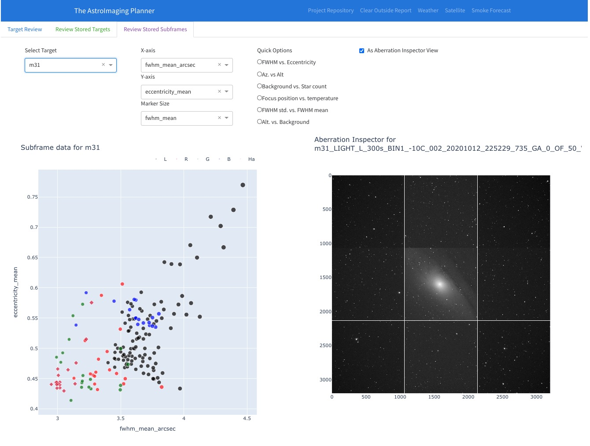
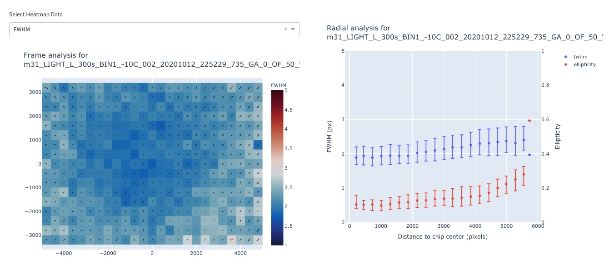
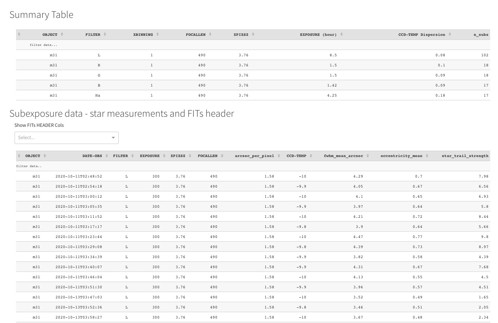

# The AstroImaging Planner

<details open="open">
  <summary>Table of Contents</summary>
  <ol>
    <li>
      <a href="#about-the-project">About The Project</a>
      <a href="#features">Dashboard Features</a>
      <ul>
        <li><a href="#target-planning">Target Planning</a></li>
        <li><a href="#target-status">Tracking Target Status</a></li>
        <li><a href="#weather">Weather</a></li>
        <li><a href="#acquired-data">Acquired Data</a></li>
        <li><a href="#subexposure-inspector">Subexposure Inspector</a></li>
      </ul>
    </li>
    <li>
      <a href="#getting-started">Getting Started</a>
      <ul>
        <li><a href="#prerequisites">Prerequisites</a></li>
        <li><a href="#installation">Installation</a></li>
        <li><a href="#docker-configuration">Docker configuration</a></li>
        <li><a href="#app-configuration">App configuration</a></li>
        <li><a href="#equipment">Equipment configuration</a></li>
      </ul>
    </li>
    <!-- <li><a href="#usage">Usage</a></li> -->
    <li><a href="#roadmap">Roadmap</a>
    <ul>
    <li>
      <a href="#future-development">Future Development</a>
    </ul>
    </li>
    <li><a href="#contributing">Contributing</a></li>
    <li><a href="#license">License</a></li>
    <!-- <li><a href="#contact">Contact</a></li> -->
    <!-- <li><a href="#acknowledgements">Acknowledgements</a></li> -->
  </ol>
</details>


# About This Project
The goal of this dashboard project is to offer the ability to view at a glance the planning and progress of astronomical targets for imaging.  There are three main components to the dashboard:
1. Target tracking and status - what are the best times in the night to image targets, allowing you to decide when to move on to another target
2. Tracking target progress - how much data each target has, broken down by filter and instrument
3. Weather forecast data
2. Acquired data - a birds-eye view of how much data has been collected on each target
3. Inspection of subexposure data - inspect subexposure data, including all FITs header data, extracted stars, and other star analyses.  Integrates with the main file store where all subexposure is stored.
5. Standalone image/star inspector for ad-hoc inspection of new frames

# Features


The targets are collected from either a [Voyager](https://software.starkeeper.it/) RoboClip Database, or a user-loaded [Sequence Generator Pro](https://www.sequencegeneratorpro.com/sgpro/) sequence file.  An example Roboclip database is given in `data/VoyRC_default.mbd`.  In creating targets for this database, the group can be set to any string.  For implementation here, I'm assuming the group description is of the form `"{optic} {sensor}"`, where the optic and sensors are defined in the equipment profiles.

## Target planning
The top chart shows the altitude of each target in the database over the course of the night, with astronomical dawn/dusk marked by the orange bands. Also shown is the altitude of the Moon.  Since the plotting is based off [Plotly](), the same interactions apply here. Each curve can be easily hidden with a single click in the legend.  Likewise, all curves can be hidden except for the target with a double click of that target in the legend. I usually switch from one target to another when their altitude lines cross to keep getting good quality data.  

On the left are settings to change the date and site location in case you are planning weeks, etc. in advance of a trip. 

There’s a dropdown for selecting the equipment profiles, which I have used the Group field in the RoboClip database. There are also dropdown to select targets by matching filters that I stored in the notes section of the roboclip entry.


## Target status
The bottom chart is a summary of data collected so far, and is read from the FITs header from the data you have on file, broken down by each filter. 

I’ve added an option of tracking the target’s status as well. Currently, there are four options:
* Pending - targets waiting to start imagining
* Active - targets actively being imaged this season
* Acquired - targets where I feel there's enough subexposure to start processing
* Closed - targets that have processing finalized
These status fields can be filtered as well for the two charts on the right.

## Weather
There’s also various weather tools like the local forecast using clearoutside, NWS, and GOES satellite links and an HRRR smoke forecast for North America.

## Acquired Data
A second tab shows the targets with gear I'd want to use to capture it, the target status (pending/active/acquired/closed), and the exposure summaries. Here’s a view of that:


## Frame inspector
A third tab shows a new section that inspects all the frames that are already stored to give more insights about your data.  This includes, but not limited to:
- Field curvature / astigmatism
- Trailing due to bad tracking and/or wind
- Total frame SNR to compare frames with similar filters against each other
- Focus position vs. temperature to check how strong focus drift is with an imaging rig
- Altitude vs. sky background to measure local LP levels

Additionally, a preview window shows either the full frame or an aberration inspector box of the subframe selected.  A local map of both FWHM and Eccentricity is given, along with the collective direction of elongation of stars.  This elongation direction is crucial in diagnosing spacing or tilt issues between the sensor and optical system.  Lastly, two tables are available:
- An all-subframe table to allow for inspection against all FITs header and other star metrics data
- An aggregate table with some summary statistics of each filter






# Getting Started


## Prerequisites:
This dashboard is built using `python` and `dash`, among other libraries.  To allow for this dashboard to run with minimal fuss, `docker` is utilized.  Therefore, [Docker](https://docs.docker.com/get-docker/) must be installed on the system used to run this dashboard.  

You can build your own docker image from these files by using `docker-compose up`, which may take some time.  This can be done by editing the `docker-compose.yml` file as noted in the file.  Alternatively, by default, you can pull down the latest image from docker hub with:
```
docker pull gshau/astroimaging-planner:latest
```

### Necessary components:
- Voyager Roboclip database file or SGP/NINA sequences
- Config files from the `conf` directory
- Data files of the format `{data_dir}/*/{fits_files}`, where `data_dir` is specified in the volume mappings.  Files are expected to have the following entries in their FITs headers:
```
  "OBJECT"
  "DATE-OBS"
  "CCD-TEMP"
  "FILTER"
  "OBJCTRA"
  "OBJCTDEC"
  "OBJCTALT"
  "INSTRUME"
  "FOCALLEN"
  "EXPOSURE"
  "XBINNING"
  "XPIXSZ"
```

## Docker configuration

Configure the `docker-compose.yml` file.  Most use-cases will only require changing the volume mappings under the app entry as shown below:
```
version: '3'
services:
    app:
        # build: . 
        image: gshau/astroimaging-planner:latest
        ports:
            - 8050:8050
        volumes:
            # path to the config files - tailor this path to your circumstances
            - /Volumes/Users/gshau/Dropbox/AstroPlanner/dash_app/conf:/app/conf
            # your DATA_DIR - tailor this path to your circumstances
            - /Volumes/Users/gshau/Dropbox/AstroBox/data:/data:ro
            # your roboclip path - tailor this path to your circumstances
            - /Volumes/Users/gshau/Dropbox/AstroBox/roboclip:/roboclip:ro
```
The directory structure after the defined data path is assumed to be of the form provided by Voyager if the date is specified as a subdirectory for each target, more explicitly, it is of the form: `{target_name}/*/{fits_files}`.  This default can be altered to accommodate other scenarios by editing the `fits_file_patterns` entry in `config.yml`

To start the app, run the following, it will download the docker image, `gshau/astroimaging-planner`, from the docker repository.  
```
docker-compose up
```

## App Configuration
The config file `conf/config.yml` contains the configuration needed to personalize the app.  This includes the file patterns for detecting subframes, site and horizon data, and custom fits header entries.  Below is an example configuration:

```
# FITs file patters in regex format, relative to DATA_DIR
fits_file_patterns:
  allow:
    - "**/*.[fF][iI][tT]"
    - "**/*.[fF][iI][tT][s]"
  reject:  # reject files with these phrases in the filename or path - case insensitive
    - "dark"
    - "bias"
    - "flat"
    - "skip"

# Default target status when initially parsing data
default_target_status: ''

# Inactive profiles to hide from the UI
default_profiles: 
  - ap92 asi6200mm
inactive_profiles: #{}
  - rasa8 asi2600mc

# target progress display mode - stack or group
progress_mode: 'group'

# Last number of days to show target progress, regardless of filters
progress_days_ago: 0

horizon_data:
  flat_horizon_alt: 10
  horizon_file: "conf/custom_horizon.txt"  # comment this line out, and behavior reverts to flat altitude
  alt_az_seperator: " "
  header_length: 3

# Webserver settings
localhost_only: "False"
debug: "True"

# Default location settings
lat: 43.37
lon: -88.37
utc_offset: -6
mpsas: 20.1
bandwidth: 120
k_extinction: 0.2
time_resolution: 300


sensor_map:
  'null': null
  "QSI 690ws HW 12.01.00 FW 06.03.04": "QSI690-wsg8"
  "QHYCCD-Cameras-Capture": "QHY16200A"
```

## Equipment
The equipment file in `conf/equipment.yml` contains the equipment descriptions that will be matched to entries in the Roboclip database.  Example configuration:
```
equipment:
  sensors:
    qsi690:
      type: 'mono'
      pixel_size: 3.69
      n_x: 3388
      n_y: 2712
      filters:
        - 'L'
        - 'R'
        - 'G'
        - 'B'
        - 'Ha'
        - 'OIII'
        - 'SII'
    asi6200mm:
      type: 'mono'
      pixel_size: 3.76
      n_x: 9576
      n_y: 6388
      filters:
        - 'L'
        - 'R'
        - 'G'
        - 'B'
        - 'Ha'
        - 'OIII'
        - 'SII'
  optics:
    ap92:
      aperture: 92
      focal_length: 489
    ontc1010:
      aperture: 254
      focal_length: 1150
```
To merge the Roboclip database and stored subexposure metadata, these components are needed:
1. The names for sensors and optics listed in this equipment file should match the RoboClip group name
2. The sensor name in this file should be contained in the `INSTRUME` entry of the FITs header
3. The focal length should match those values stored in the `FOCALLEN` entry of the FITs header within a 2mm margin of error.

## Custom Horizon
There's an option to allow for a custom horizon, where if the target falls below this horizon, it's rendered as a thinner and more transparent altitude trace in the top figure.  The location and format of this file is specified in the `conf/config.yml` file.  If no file is given, a flat horizon level can be specified.  
# Roadmap
## Future development
I have in development a contrast view, which takes into account the bandwidth of filters and the SNR with certain levels of LP, whether it be artificial light from the city, or natural light from the Moon. This also can be extended to include the effect of aerosols in the atmosphere like the smoke we’ve been getting over much of the US this year.

See below for the wishlist of things I'd like to implement for the future.  
### Wishlist:
- [x] Custom horizon
  - [x] Alpha reduced on inaccessible targets
- [x] Target status to filter acquired data chart
- [x] Internal: Unified dataframe for all targets
- [x] Add dark sky duration
- [-] Automatic grading of images
- [ ] Revised contrast calculations for narrowband/broadband filters
- [ ] mpsas level at current location for contrast
- [ ] Target selection via user-controlled:
  - [ ] priority
  - [ ] filter goals
  - [ ] exposure totals and progress
- [ ] Add OpenWeatherMap datasource
- [ ] Suggested target and filter sequences
  - [ ] Show color-coded blocks of when filters are used
  
# License
Distributed under the GPLv3 License. See `LICENSE` for more information.


