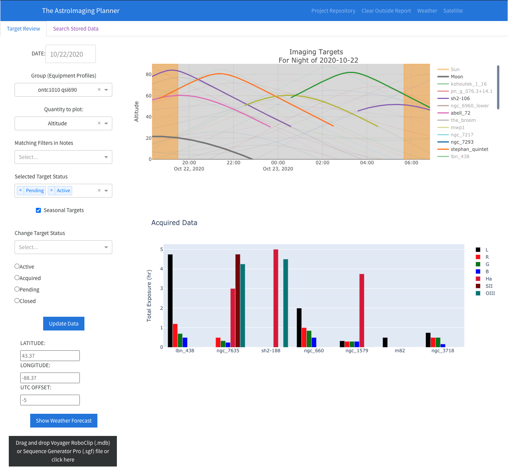
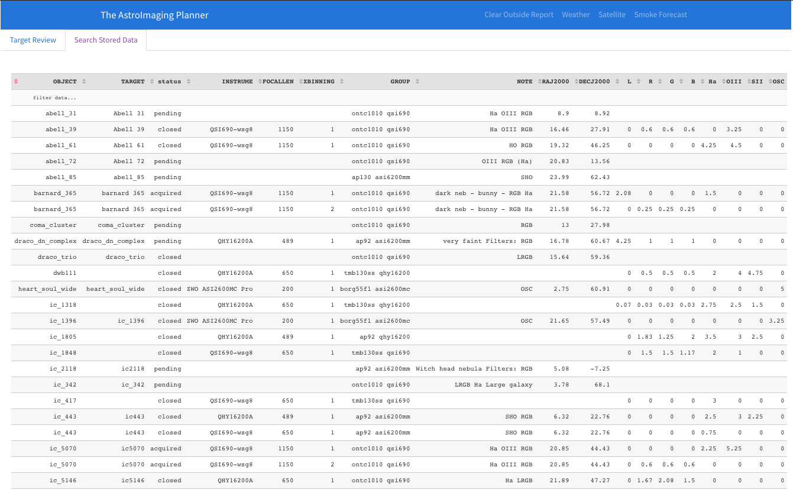

# AstroPlanner

## Introduction
The goal of this dashboard project is to offer the ability to view at a glance the planning and progress of astronomical targets for imaging.  There are two main components to the dashboard:
1. Target status - what are the best times in the night to image targets, allowing you to decide when to move on to another target
2. Acquired data - a birds-eye view of how much data has been collected on each target




The targets are collected from either a [Voyager](https://software.starkeeper.it/) RoboClip Database, or a user-loaded [Sequence Generator Pro](https://www.sequencegeneratorpro.com/sgpro/) sequence file.  An example Roboclip database is given in `data/VoyRC_default.mbd`.  In creating targets for this database, the group can be set to any string.  For implementation here, I'm assuming the group description is of the form `"{optic} {sensor}"`, where the optic and sensors are defined in the equipment profiles.

### Target planning
The top chart shows the altitude of each target in the database over the course of the night, with astronomical dawn/dusk marked by the orange bands. Also shown is the altitude of the Moon.  Since the plotting is based off [Plotly](), the same interactions apply here. Each curve can be easily hidden with a single click in the legend.  Likewise, all curves can be hidden except for the target with a double click of that target in the legend. I usually switch from one target to another when their altitude lines cross to keep getting good quality data.  

On the left are settings to change the date and site location in case you are planning weeks, etc. in advance of a trip. 

There’s a dropdown for selecting the equipment profiles, which I have used the Group field in the RoboClip database. There are also dropdown to select targets by matching filters that I stored in the notes section of the roboclip entry.

### Target status
The bottom chart is a summary of data collected so far, and is read from the FITs header from the data you have on file, broken down by each filter. 

### Status tracking
I’ve added an option of tracking the target’s status as well. Currently, there are four options:
* Pending - targets waiting to start imagining
* Active - targets actively being imaged this season
* Acquired - targets where I feel there's enough subexposure to start processing
* Closed - targets that have processing finalized
These status fields can be filtered as well for the two charts on the right.

### Weather
There’s also various weather tools like the local forecast using clearoutside, NWS, and GOES satellite links and more relevant lately - a smoke forecast.


### Stored Data View
I also have another tab which shows the targets with gear I want to use to capture it, the target status (pending/active/acquired/closed), and the exposure summaries. Here’s a view of that:



### Future development
I also have in development a contrast view, which takes into account the bandwidth of filters and the SNR with certain levels of LP, whether it be artificial light from the city, or natural light from the Moon. This also can be extended to include the effect of aerosols in the atmosphere like the smoke we’ve been getting over much of the US this year.

See below for the wishlist of things I'd like to implement for the future.  


# Getting up and running
This dashboard is built using `python` and `dash`, among other libraries.  To simplify starting it up, `docker` is utilized.  To get up and running, `docker` must be installed on your system.  Configure the `docker-compose.yml` file
```
version: '3'
services:
    app:
        build: .
        ports:
            - 8050:8050   # port where this webserver will run
        environment:  # changes here not likely needed
            - DATA_DIR=/data
            - ROBOCLIP_FILE=/roboclip/VoyRC.mdb
        volumes:  
            # no change needed:
            - /Volumes/Users/gshau/Dropbox/AstroBox/config:/app/config  
            # your data path - tailor this path to your circumstances
            - /Volumes/Users/gshau/Dropbox/AstroBox/data:/data  
            # your roboclip path - tailor this path to your circumstances
            - /Volumes/Users/gshau/Dropbox/AstroBox/roboclip:/roboclip 
```
The directory structure after the defined data path is assumed to be of the form provided by Voyager if the date is specified as a subdirectory for each target, more explicitly, it is of the form: `{target_name}/{date}/{fits_files}`.  This default can be altered to accommodate other scenarios by editing the `fits_file_patterns` entry in `config.yml`

## Configuration
The config file `conf/config.yml` contains the configuration.  Example configuration:

```
# FITs file patters in regex format, relative to DATA_DIR
fits_file_patterns:
  - "/*/*/*.[fF][iI][tT]"
  - "/*/*/*.[fF][iI][tT]s"
  - "/*/*/Lights/*.[fF][iI][tT]"
  - "/*/*/Lights/*.[fF][iI][tT][s]"

# target progress display mode - stack or group
progress_mode: 'group'

# Last number of days to show target progress, regardless of filters
progress_days_ago: 0

horizon_data:
  flat_horizon_alt: 10
  horizon_file: "data/custom_horizon.txt"
  alt_az_seperator: " "
  header_length: 3
```

## Equipment
The equipment file in `conf/equipment.yml` contains the equipment descriptions that will be matched to entries in the Roboclip database.  Example configuration:
```
equipment:
  sensors:
    qsi690:
      type: 'mono'
      pixel_size: 3.69
      n_x: 3388
      n_y: 2712
      filters:
        - 'L'
        - 'R'
        - 'G'
        - 'B'
        - 'Ha'
        - 'OIII'
        - 'SII'
    asi6200mm:
      type: 'mono'
      pixel_size: 3.76
      n_x: 9576
      n_y: 6388
      filters:
        - 'L'
        - 'R'
        - 'G'
        - 'B'
        - 'Ha'
        - 'OIII'
        - 'SII'
  optics:
    ap92:
      aperture: 92
      focal_length: 489
    ontc1010:
      aperture: 254
      focal_length: 1150
```
To merge the Roboclip database and stored data, these components are needed:
1. The names for sensors and optics listed in this equipment file should match the RoboClip group name
2. The sensor name in this file should be contained in the `INSTRUME` entry of the FITs header
3. The focal length should match those values stored in the `FOCALLEN` entry of the FITs header within a 2mm margin of error.

## Custom Horizon
There's an option to allow for a custom horizon, where if the target falls below this horizon, it's rendered as a thinner and more transparent altitude trace in the top figure.  The location and format of this file is specified in the `conf/config.yml` file.  If no file is given, a flat horizon level can be specified.  


# Wishlist:
- [x] Custom horizon
  - [x] Alpha reduced on inaccessible targets
- [x] Seasonal targets to filter acquired data chart
- [x] Internal: Unified dataframe for all targets
- [ ] Revised contrast calculations for narrowband/broadband filters
- [ ] mpsas level at current location for contrast
- [ ] Automatic grading of images
- [ ] User-controlled
  - [ ] priority
  - [ ] filter goals
  - [ ] exposure totals and progress
- [ ] Add OpenWeatherMap datasource
- [ ] Suggested target and filter sequences
  - [ ] Show color-coded blocks of when filters are used